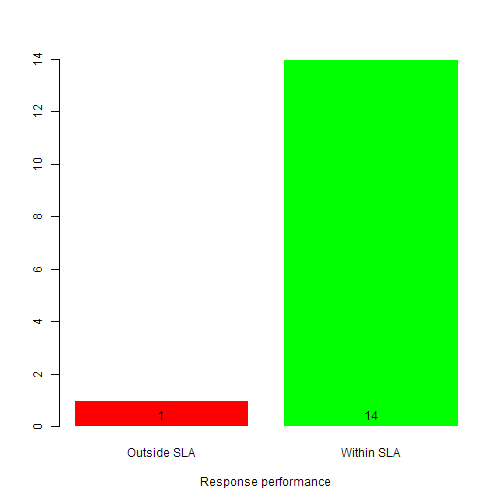

## Response performance of help desks and call centers


Help desk and call centers that respond to and resolve service requests have a need to know and report on their performance.

--- .class #id 

## Response performance app

The Response performance Shiny app reports a help desk's performance on the requests it receives measured against a set service level agreement (SLA). 

Given the number of days to respond to a request (SLA), it provides the count of requests that are within the SLA days (in green) and the ones outside (in red) in a simple bar plot.

--- .class #id 

## The response performance app in action

The app output for a response SLA of 2 days is shown below. An interactive version is available at the following link in shinyapps.io <a href=https://dineshkb.shinyapps.io/slaCalc/>response performance</a>




```
Error in b$show: $ operator is invalid for atomic vectors
```

--- .class #id 

## In conclusion


The Response performance app provides an easy way to report performance of a help desk against a given reponse SLA.


--- .class #id 
